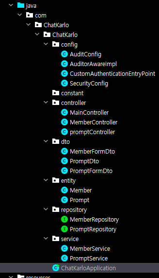
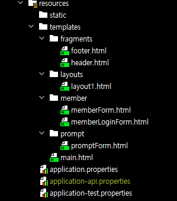

How to Use ChatDall-E
==========================
해당 문서에서는 ChatDall-E의 시스템 구조 및 설계에 대해 설명하고
ChatDall-E의 구동에 필요한 요소들에 대해 설명합니다.

시스템 구조 및 설계
-------------------


해당 웹 서비스는 Spring boot와 JPA를 사용하여 만들어졌습니다.

데이터의 경우 회원 정보를 관리하는 Member와 입력된 문장, 지시어, 이미지를
관리하는 Prompt로 나누어져 있으며 세부사항은 아래의 표와 같습니다.

## Member

| NO  | NAME      | DATA TYPE | PK  |FK| AI  |NULLABLE|
|-----|-----------|-----------|-----|---|-----|---|
| 1   | member_id | Long      | O   |   | O   |   |
| 2   | email     | String    |     |   |     |   |
| 3   | password  | String    |     |   |     |   |
| 4   | nickname  | String    |     |   |     |   |

## Prompt

| NO  | NAME        | DATA TYPE | PK  | FK  | AI  | NULLABLE |
|-----|-------------|-----------|-----|-----|-----|----------|
| 1   | prompt_id   | Long      | O   |     | O   |          |
| 2   | beforeWords | String    |     |     |     | O        |
| 3   | afterWords  | String    |     |     |     | O        |
| 4   | url         | String    |     |     |     | O        |
| 5   | member_id   | Long      |     | O   |     |          |

(PK: 기본 키, FK: 외래 키, AI: 자동 증가(Auto Increase), NULLABLE: NULL값 가능)

Prompt entity의 경우 사용자가 입력한 자연어 문장을 beforWords에, GPT-3.5를
거쳐 번역 및 추출된 지시어를 afterWords에, 해당 지시어를 통해
DALL-E 2가 생성한 이미지의 URL을 url에 저장하여 관리합니다.

또한 Member와 Prompt 사이에는 1:1 매핑 관계를 가지고 있어 사용자의
계정 하나당 하나의 Prompt 데이터를 가질 수 있습니다.

이를 바탕으로 사용자가 View 단에서 회원 데이터나 지시어 데이터의 요청 및 등록, 수정을
진행하게 되면 위 사진과 같이 각각의 Controller가 명령을 받아 기능을 수행하게 됩니다.




View의 경우 HTML과 Thymeleaf layout을 통해 만들어 졌으며
header, content, footer의 레이아웃 구성을 가지고 있습니다.

header는 상단 메뉴바의 역활을 하며
각각의 메뉴 클릭 및 기능 동작에 따라 content 항목이 지정해둔 HTML 화면으로
전환되는 구조입니다.


기타 사항
------

해당 파일에서는 위의 사진에서 볼 수 있듯이 OpenAI의 API Key 값을
application-api.properties 파일에 저장하여 관리하고 있습니다.

하지만 개인 API Key 값의 보안 문제로 GitHub에는 해당 파일이 업로드 되어있지 않기 때문에
application.properties 파일이 있는 경로(src/main/resources/)에
아래와 같이 파일을 작성하셔야합니다.

### application-api.properties
```PROPERTIES
openai.api.key=여기에 openai key 값 입력
```