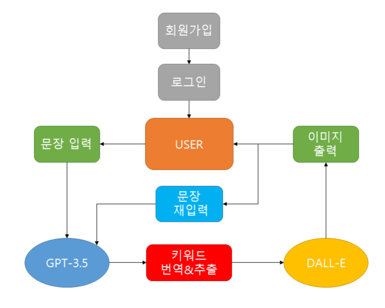

About ChatDall-E
==================
ChatDall-E는 Barqawiz의 GitHub에서 오픈소스로 공유된 IntelliJava를 사용해
OpenAI의 GPT-3.5와 DALL-E 2 API를 연동한 Spring boot 웹 서비스입니다.

IntelliJava GitHub : <https://github.com/Barqawiz/IntelliJava>

제공 기능
-----------

해당 웹 서비스는 크게 로그인 기능, 문장 번역&추출, 이미지 생성으로 구성되어 있습니다.

이메일, 비밀번호, 닉네임을 입력해 회원가입을 진행하여 해당 계정으로 로그인 하시면
이미지 생성 메뉴에 접근 할 수 있습니다.

이후 이미지 생성 화면에서 원하는 문장을 입력하면, GPT-3.5를 통해
해당 문장을 DALL-E 2에서 요구하는 간결한 영어 문장으로 번역 및 추출하며
이를 통해 생성된 지시문(prompt)를 DALL-E 2로 보내 1024X1024 사이즈의
이미지를 1개 생성합니다.

입력한 문장과 지시문, 이미지는 계정마다 한 개씩 데이터로 저장되어
관리되기 떄문에 웹 서비스를 종료한 뒤 다시 접속하더라도
이미지 생성 화면에서 다시 확인 할 수 있습니다.

이를 통해 입력한 문장과 생성된 이미지 사이에 비교가 가능하며
문장을 수정 및 다시 입력하여 새로운 이미지를 생성할 수 있습니다.

(단 문장 수정 및 재입력 시 기존의 데이터는 사라지기 때문에 이미지를 저장한 뒤 진행해야합니다.)